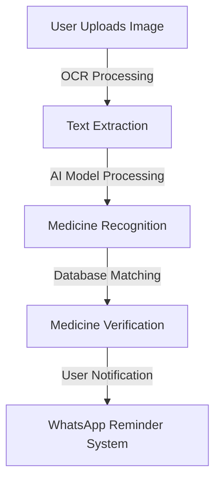
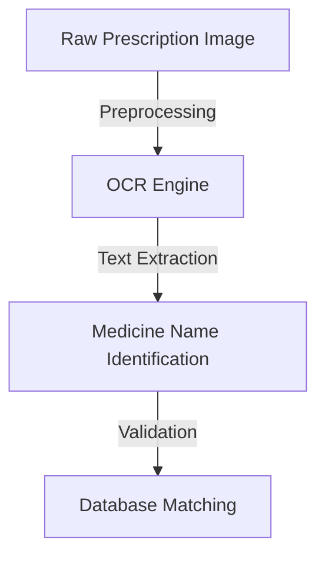
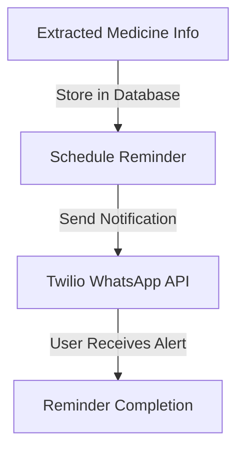

# 💊 PillBot

## 📌 Overview

PillBot is an AI-powered medicine-selling platform designed to enhance user convenience by integrating Optical Character Recognition (OCR) for seamless medicine package scanning and WhatsApp-based automated medication reminders. The system is specifically designed for individuals aged 55-60 managing chronic conditions, ensuring timely medication intake and improving healthcare accessibility.

## 🌟 Concept

The core idea behind PillBot is to simplify the medicine purchasing and reminder process for elderly individuals. By leveraging OCR, AI-driven automation, and WhatsApp reminders, the platform minimizes human errors and enhances adherence to prescriptions, making medication management more efficient and accessible.

## 🌍 Problem Statement

PillBot aims to improve medication adherence by integrating OCR-based medicine recognition with WhatsApp reminders. The AI-driven approach minimizes errors and enhances accessibility for elderly users managing chronic conditions.

## 🏗️ System Architecture

### 🔧 Model Components

1. **🌐 Medicine Recognition Engine**
2. **📝 Prescription Analysis Module**
3. **🌿 DrugBank API for Medicine Details**
4. **📩 WhatsApp API for Reminders**

### 📊 Model Architecture Flowchart



### 🌐 AI Models Used

```python
# Load OCR models
import torch
from transformers import TrOCRProcessor, VisionEncoderDecoderModel
from paddleocr import PaddleOCR

trocr_processor = TrOCRProcessor.from_pretrained("microsoft/trocr-base-handwritten")
trocr_model = VisionEncoderDecoderModel.from_pretrained("microsoft/trocr-base-handwritten").to(device)
paddle_ocr = PaddleOCR(use_angle_cls=True, lang="en")
```

## 👨‍💻 Data Preparation & Analysis

### 🔍 Data Preparation Steps

1. **🎮 Data Augmentation:** Enhancing dataset diversity.
2. **🛠️ Preprocessing:** Noise reduction and contrast enhancement.
3. **📊 Model Training:** Fine-tuning AI models.
4. **📊 Data Analysis:** Evaluating model performance through precision, recall, and accuracy metrics.

## ⚙️ How It Works

1. **🖼️ Medicine Recognition:**
   - The user uploads an image of a medicine package or prescription.
   - AI extracts the medicine name and matches it with the database.
2. **📝 Prescription Processing:**
   - OCR models extract text from prescriptions.
   - Additional preprocessing is applied for better text recognition.
3. **⏰ Automated Reminders:**
   - Extracted medicine details are stored in the system.
   - Twilio’s WhatsApp API and Celery handle scheduled reminders.

## 🏗️ Model-Specific Architectures

### 📜 OCR Model Architecture



### 📩 Reminder System Architecture



## 🗂️ Dataset Details

- **🖼️ Image Data:** Medicine package and prescription images.
- **🍿 Custom Data:** Labeled images for training AI models.
- **📊 Augmented Data:** Variants of images for model robustness.
- **🔢 Data Labels:** Medicine names, dosage, and expiry information.

## 📜 File Details

- **`main.py`** - Core execution script.
- **`model.py`** - AI model and OCR processing logic.
- **`database.db`** - SQLite/PostgreSQL database for storing medicine details.
- **`requirements.txt`** - List of dependencies.
- **`README.md`** - Documentation and project overview.

## 🛠️ Installation & Dependencies

### ✅ Prerequisites

- Python 3.8+
- Virtual Environment (optional but recommended)

### 📦 Install Dependencies

```bash
!sudo apt install tesseract-ocr
!pip install pytesseract opencv-python numpy easyocr fuzzywuzzy python-Levenshtein nltk
!pip install pytesseract opencv-python pandas fuzzywuzzy spacy transformers
!pip install pytesseract opencv-python numpy easyocr fuzzywuzzy python-Levenshtein nltk
```
## Import necessary libraries
```bash
import cv2
import pytesseract
import numpy as np
import easyocr
import re
import nltk
from nltk.corpus import words
from PIL import Image
import matplotlib.pyplot as plt
```

## 🔗 API Configuration

### 💊 DrugBank API

- **Endpoint:** `https://api.drugbank.com/v1/drugs/search?q=Paracetamol`
- **Returns:** Medicine name, solution, and related information.


### ▶️ Running the Application

```bash
python app.py
```

## 📸 Screenshots


## 🛠️ Built With

- **🐍 Flask/Django** - Backend Framework
- **🗃️ PostgreSQL** - Database Management
- **🔍 Tesseract OCR** - Text Extraction
- **🖼️ OpenCV** - Image Processing
- **📩 Twilio WhatsApp API** - Messaging
- **⏳ Celery** - Task Scheduling
## 🏗️ About the Developer
"PillBot was developed through the collaboration of Pranaya and Varun."
---


